# StudyFlow Lite: Deterministic Low-Power Study Cycle Pacing & Mastery System

[](https://nextjs.org/)
[](https://react.dev/)
[](https://www.typescriptlang.org/)
[](https://capacitorjs.com/)
[](https://tailwindcss.com/)
[](LICENSE)
[](#)
[](#)
[](#)

> **Personal Engineering Project** | **Project ID: 004/2026** | **Year of Project: 2026**  
> An edge-first, zero-latency study cycle tracking and pacing engine built to manage and optimize rigorous self-study schedules. Solves *cognitive workload paralysis* and syllabus fragmentation using a **Deterministic Active Focus Wallet**, **Sequential Prerequisite Auto-Unlocking**, **Dynamic Lecture Velocity Pacing ($V_{\text{req}}$)**, and **Strict Workload Subspace Metric Isolation**. Designed as a high-efficiency Progressive Web App (PWA) with native Android deployment via Capacitor.

---

## 📌 Table of Contents
- [Project Overview & Key Innovations](#-project-overview--key-innovations)
- [Problem Statement & Educational Motivation](#-problem-statement--educational-motivation)
- [Core Distinctive Features](#-core-distinctive-features)
- [System Architecture](#-system-architecture)
- [Algorithmic Workflow & State Machine Flowcharts](#-algorithmic-workflow--state-machine-flowcharts)
  - [1. End-to-End System Flowchart](#1-end-to-end-system-flowchart)
  - [2. Sequential Chapter Auto-Unlock State Machine](#2-sequential-chapter-auto-unlock-state-machine)
- [Theoretical Formulation & Mathematical Foundations](#-theoretical-formulation--mathematical-foundations)
  - [1. Dynamic Required Study Velocity ($V_{\text{req}}$)](#1-dynamic-required-study-velocity-v_textreq)
  - [2. Active Workload Subspace Metric Formulation](#2-active-workload-subspace-metric-formulation)
  - [3. Finite State Automaton (FSA) for Sequential Prerequisite Mastery](#3-finite-state-automaton-fsa-for-sequential-prerequisite-mastery)
  - [4. Circular SVG Progress Indicator Geometry & Coordinate Dynamics](#4-circular-svg-progress-indicator-geometry--coordinate-dynamics)
  - [5. Zero-Latency Edge Persistence & Deterministic Time Complexity](#5-zero-latency-edge-persistence--deterministic-time-complexity)
- [Visual Output Gallery & Interface Walkthrough](#-visual-output-gallery--interface-walkthrough)
  - [1. Dashboard & Active Focus Wallet Card](#1-dashboard--active-focus-wallet-card)
  - [2. Course Library & Collapsible Subject Accordion](#2-course-library--collapsible-subject-accordion)
  - [3. Chapter Pacing Badges & Interactive Increment Controls](#3-chapter-pacing-badges--interactive-increment-controls)
  - [4. New Chapter Creation Modal](#4-new-chapter-creation-modal)
  - [5. Chapter Configuration & Deletion Modal](#5-chapter-configuration--deletion-modal)
  - [6. Subject Library Manager & Metric Exclusion Toggles](#6-subject-library-manager--metric-exclusion-toggles)
  - [7. Destructive Subject Deletion Confirmation Alert](#7-destructive-subject-deletion-confirmation-alert)
  - [8. New Course / Subject Creation Modal](#8-new-course--subject-creation-modal)
  - [9. Sequential Prerequisite Auto-Unlock in Action](#9-sequential-prerequisite-auto-unlock-in-action)
  - [10. Completed Subject Auto-Lock & 100% Course Mastery](#10-completed-subject-auto-lock--100-course-mastery)
  - [11. Cold Start & Zero-State Onboarding Screen](#11-cold-start--zero-state-onboarding-screen)
- [Repository Structure](#-repository-structure)
- [Step-by-Step Installation & Run Guide](#-step-by-step-installation--run-guide)
  - [Prerequisites](#prerequisites)
  - [Step 1: Clone Repository](#step-1-clone-repository)
  - [Step 2: Install Node Dependencies](#step-2-install-node-dependencies)
  - [Step 3: Run Development Server](#step-3-run-development-server)
  - [Step 4: Build Static Production Export](#step-4-build-static-production-export)
  - [Step 5: Capacitor Android Synchronization & APK Compilation](#step-5-capacitor-android-synchronization--apk-compilation)
  - [Step 6: Running the Standalone Prebuilt APK](#step-6-running-the-standalone-prebuilt-apk)
- [Confidentiality & Production Readiness Audit](#-confidentiality--production-readiness-audit)
- [Author & Project Details](#-author--project-details)
- [License](#-license)

---

## 🔭 Project Overview & Key Innovations

Students in rigorous STEM curricula regularly grapple with large-scale curriculum structures spanning dozens of subjects and hundreds of lecture hours. Standard task managers, to-do lists, and calendar applications suffer from three critical deficiencies:
1. **Cognitive Workload Paralysis**: Showing a student 150 unfinished lectures simultaneously causes demotivating decision fatigue.
2. **Context Switching Friction**: Logging into heavy cloud dashboards or navigating deep nested menus simply to mark a 45-minute lecture completed adds unnecessary friction.
3. **Flawed Workload Averaging**: Standard apps lump distant, future, or inactive courses into current progress calculations, severely distorting daily academic pacing.

**StudyFlow Lite (Project 004/2026)** is engineered from first principles to resolve these exact bottlenecks. It introduces:
- **Active Focus Wallet Carousel**: An instant-access top card that isolates *only the single active, incomplete chapter* for each active course. Students can increment their lecture count with a single tap, with zero page reloads.
- **Strict Workload Subspace Metric Isolation**: Inactive or locked subjects/chapters are mathematically excluded from the active metric denominator. Students view progress reflecting *only their immediate active workload*.
- **Sequential Prerequisite Auto-Unlocking**: Emulates real pedagogical mastery. Completing the final lecture of Chapter $n$ automatically triggers the unlocking of Chapter $n+1$, preventing students from jumping ahead without foundational mastery.
- **Dynamic Velocity Pacing ($V_{\text{req}}$)**: Dynamically computes required study rate ($\text{lectures/day}$) against real target exam deadlines with color-coded urgency bands.
- **Edge-Offline Zero-Latency Architecture**: Operates 100% on the device edge using local storage persistence, ensuring zero latency, zero cloud tracking, and total offline capability.

---

## 🎯 Problem Statement & Educational Motivation

| Parameter | Conventional Study / Task Planners | StudyFlow Lite (Project 004/2026) |
| :--- | :--- | :--- |
| **Cognitive Surface** | Shows hundreds of upcoming tasks across entire semester | **Active Focus Wallet**: Shows exclusively the current actionable chapter |
| **Increment Friction** | Open app $\to$ Select course $\to$ Select module $\to$ Edit task | **Single-Tap Increment**: Front-and-center card with animated ripple |
| **Syllabus Progression** | Unconstrained, chaotic task jumping | **Deterministic Sequential Auto-Unlock**: Chapters unlock strictly upon completion |
| **Progress Metric** | Distorted across total yearly curriculum ($4/250 = 1.6\%$) | **Isolated Active Metric**: Measured only over current active units ($4/10 = 40\%$) |
| **Target Pacing** | Static due date with no daily velocity feedback | **Dynamic Daily Velocity ($V_{\text{req}}$)**: Real-time $\text{lectures/day}$ calculation |
| **Network & Privacy** | Requires mandatory cloud login, sync lag, data tracking | **100% Offline Edge Persistence**: Zero cloud latency, client-side encryption |
| **Deployment Footprint**| Heavy multi-megabyte app store download | **Ultra-Lightweight PWA + Native Capacitor Android APK (4.7 MB)** |

---

## ⚡ Core Distinctive Features

1. **Active Focus Wallet**:
   A horizontally swipeable Embla Carousel displaying high-contrast cards for active, incomplete chapters. Features dynamic SVG circular progress rings, immediate status feedback, and color-coded deadline countdowns (`Overdue`, `Due Today`, `Xd left`).
2. **Sequential Prerequisite Auto-Unlock**:
   Guarantees structured educational progression. Once `completedLectures === totalLectures`, the system automatically activates the next ordered chapter in the sequence.
3. **Automatic Course Completion Archival**:
   When all chapters within a subject reach 100% completion, the subject automatically transitions to a completed/locked archive state (`isLocked = true`), keeping the active dashboard pristine.
4. **Subject Metric Exclusion Toggles**:
   Allows students to toggle subjects between "Active" and "Excluded from active metrics", giving total control over current focus areas (e.g., preparing for Midterms vs. Endterms).
5. **Real-Time Study Velocity Alerts**:
   Calculates required study velocity ($V_{\text{req}}$ in $\text{lectures/day}$) dynamically updated as calendar days progress.
6. **Ultra-Low Latency & High Battery Efficiency**:
   Zero remote API polling or background daemon synchronization. Maximizes battery life on mobile devices during extended study sessions.

---

## 🏗 System Architecture

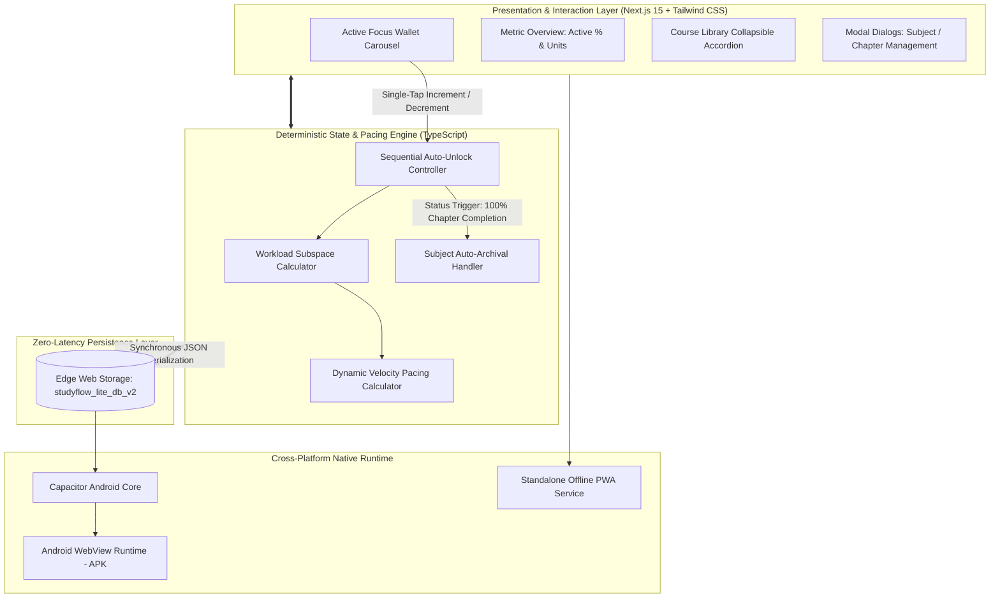

---

## 📊 Algorithmic Workflow & State Machine Flowcharts

### 1. End-to-End System Flowchart

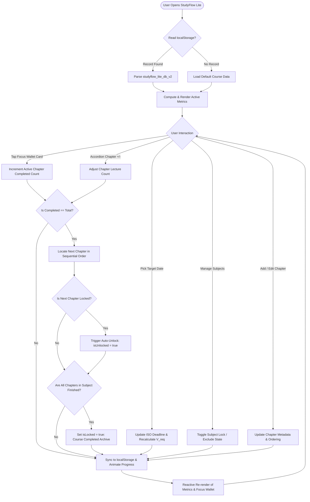

### 2. Sequential Chapter Auto-Unlock State Machine

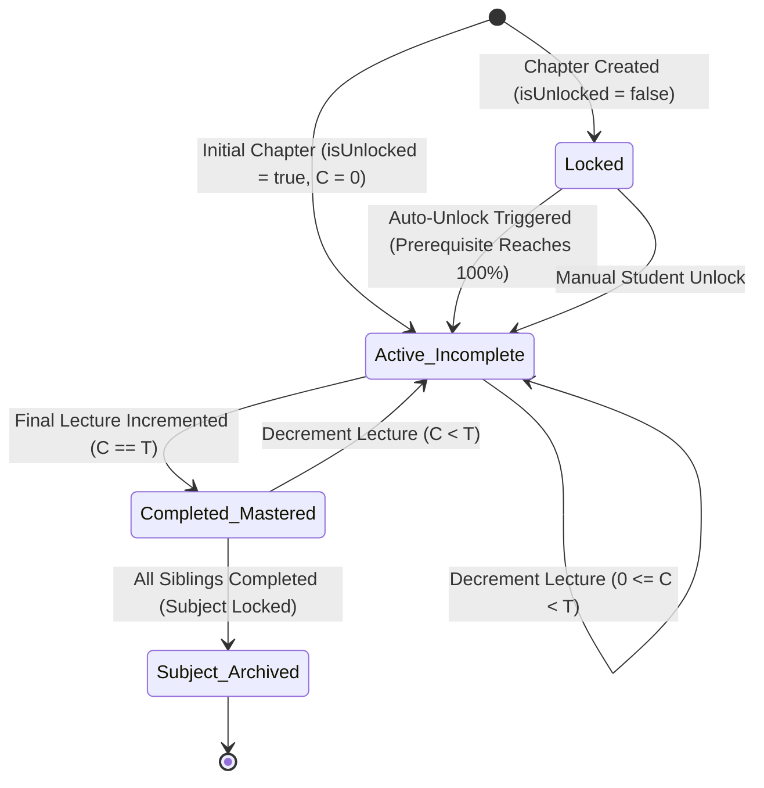

---

## 📐 Theoretical Formulation & Mathematical Foundations

### 1. Dynamic Required Study Velocity ($V_{\text{req}}$)

To prevent procrastination and eliminate ambiguous study targets, StudyFlow Lite formulates study velocity as a real-time boundary-value function.

Let a given chapter $k$ possess total required lectures $T_k \in \mathbb{N}^+$ and completed lectures $C_k \in \{0, 1, \dots, T_k\}$.  
Let the target examination or deadline timestamp be $t_{\text{deadline}}$ and the current edge clock timestamp be $t_{\text{current}}$.

The remaining calendar duration in integer days $\Delta t_k$ is computed via:
$$\Delta t_k = \Big\lfloor \frac{\text{startOfDay}(t_{\text{deadline}}) - \text{startOfDay}(t_{\text{current}})}{86,400,000 \text{ ms}} \Big\rfloor$$

The required daily completion velocity $V_{\text{req}}(k)$ (in $\text{lectures/day}$) is dynamically evaluated as:
$$V_{\text{req}}(k) = \begin{cases} 
\dfrac{T_k - C_k}{\Delta t_k}, & \text{if } \Delta t_k > 0 \text{ and } C_k < T_k \\ 
\infty \; (\text{"Due Today"}), & \text{if } \Delta t_k = 0 \text{ and } C_k < T_k \\ 
-1 \; (\text{"Overdue"}), & \text{if } \Delta t_k < 0 \text{ and } C_k < T_k \\ 
0, & \text{if } C_k = T_k 
\end{cases}$$

**Urgency Tier Classification**:
$$\text{Urgency}(k) = \begin{cases}
\text{CRITICAL (Red Pulse: \texttt{bg-red-500/20})}, & \text{if } \Delta t_k < 3 \\
\text{OPTIMAL (Cyan Glow: \texttt{bg-primary/10})}, & \text{if } \Delta t_k \ge 3
\end{cases}$$

---

### 2. Active Workload Subspace Metric Formulation

Standard study applications compute progress across the entire registered curriculum $\mathcal{S}_{\text{all}}$, distorting immediate focus. StudyFlow Lite partitions the academic state into an **Active Subspace** $\mathcal{S}_{\text{active}}$ and an **Archived/Excluded Subspace** $\mathcal{S}_{\text{locked}}$.

Let $\mathcal{S}$ denote the set of enrolled subjects, where each subject $s \in \mathcal{S}$ has state parameter $L_s \in \{0, 1\}$ ($0 = \text{unlocked/active}$, $1 = \text{locked/excluded}$).  
Each subject contains ordered chapters $\mathcal{C}_s = \{c_{s,1}, c_{s,2}, \dots, c_{s,m_s}\}$, where each chapter has total lectures $T_{s,i}$ and completed lectures $C_{s,i}$.

The **Active Total Workload** $W_{\text{active}}$ and **Active Completed Units** $U_{\text{active}}$ are:
$$W_{\text{active}} = \sum_{s \in \mathcal{S}} (1 - L_s) \sum_{i=1}^{m_s} T_{s,i}$$
$$U_{\text{active}} = \sum_{s \in \mathcal{S}} (1 - L_s) \sum_{i=1}^{m_s} C_{s,i}$$

The aggregate **Active Course Progress Percentage** $\mathcal{P}_{\text{active}}$ is defined as:
$$\mathcal{P}_{\text{active}} = \begin{cases}
\text{round}\left( \dfrac{U_{\text{active}}}{W_{\text{active}}} \times 100 \right), & \text{if } W_{\text{active}} > 0 \\
0, & \text{if } W_{\text{active}} = 0
\end{cases}$$

This ensures that completing inactive courses or postponing optional subjects never penalizes the active progress metric.

---

### 3. Finite State Automaton (FSA) for Sequential Prerequisite Mastery

To prevent cognitive overload from attempting advanced topics prematurely, chapters obey a strict finite state transition rule.

For a subject $s$ with ordered chapters $(c_{s,1}, c_{s,2}, \dots, c_{s,m})$, the prerequisite unlocking condition for chapter $c_{s,j}$ ($j > 1$) is:
$$\text{Unlocked}(c_{s,j}) = \text{True} \iff \Big( C_{s, j-1} = T_{s, j-1} \Big) \lor \text{ManualOverride}(c_{s,j})$$

When the final lecture of chapter $c_{s,j-1}$ is completed ($C_{s,j-1} \to T_{s,j-1}$), the transition trigger operates:
$$\delta\big(c_{s,j}, C_{s,j-1} = T_{s,j-1}\big) \implies \text{isUnlocked}(c_{s,j}) \leftarrow \text{True}$$

When all chapters within a subject are completed:
$$\forall i \in \{1, \dots, m_s\}, \; C_{s,i} = T_{s,i} \implies L_s \leftarrow 1 \quad (\text{Auto-Lock Subject to Archive})$$

---

### 4. Circular SVG Progress Indicator Geometry & Coordinate Dynamics

The custom SVG circular progress ring implements deterministic polar-to-Cartesian stroke mapping without external heavyweight charting libraries.

For an SVG viewport of size $S \times S$ and stroke width $w$:
1. **Geometric Radius**:
   $$r = \frac{S - w}{2}$$
2. **Total Circle Circumference**:
   $$\mathcal{K} = 2 \pi r$$
3. **Stroke Dash Offset**:
   To represent completion percentage $p \in [0, 100]$:
   $$\text{offset}(p) = \mathcal{K} \cdot \left(1 - \frac{p}{100}\right)$$

By establishing a $-90^\circ$ coordinate rotation (`transform -rotate-90`), progress begins at the 12 o'clock position and advances smoothly clockwise via hardware-accelerated CSS transitions:
$$\text{CSS Transition: } \Delta \text{offset} \propto \text{ease-in-out}, \; \tau = 500\text{ ms}$$

---

### 5. Zero-Latency Edge Persistence & Deterministic Time Complexity

All mutations execute synchronously in memory and commit to edge storage with deterministic time complexity:

| Operation | Mathematical Representation | Algorithmic Complexity | Edge Storage Latency |
| :--- | :--- | :---: | :---: |
| **Lecture Increment** | $C_{s,i} \leftarrow \min(C_{s,i} + 1, T_{s,i})$ | $\mathcal{O}(1)$ | $< 1\text{ ms}$ |
| **Sequential Auto-Unlock** | $\min_{k > i} \{c_{s,k} \mid \neg \text{isUnlocked}(c_{s,k})\}$ | $\mathcal{O}(m)$ | $< 1\text{ ms}$ |
| **Metric Recalculation** | $\mathcal{P}_{\text{active}} = U_{\text{active}} / W_{\text{active}}$ | $\mathcal{O}(N_{\text{chapters}})$ | $< 2\text{ ms}$ |
| **Edge Serialization** | $\text{JSON.stringify}(\mathcal{S}) \to \text{localStorage}$ | $\mathcal{O}(K_{\text{bytes}})$ | $< 3\text{ ms}$ |

---

## 🖼 Visual Output Gallery & Interface Walkthrough

Every screen below represents an authentic high-resolution capture of StudyFlow Lite executing on mobile viewport ($430 \times 932$, Retina $2\times$ pixel ratio) in dark mode:

### 1. Dashboard & Active Focus Wallet Card
The primary command center featuring the **Active Focus Wallet Carousel**, real-time **Active Progress (40%)**, and **Active Units (4/10 Lectures)** metrics:

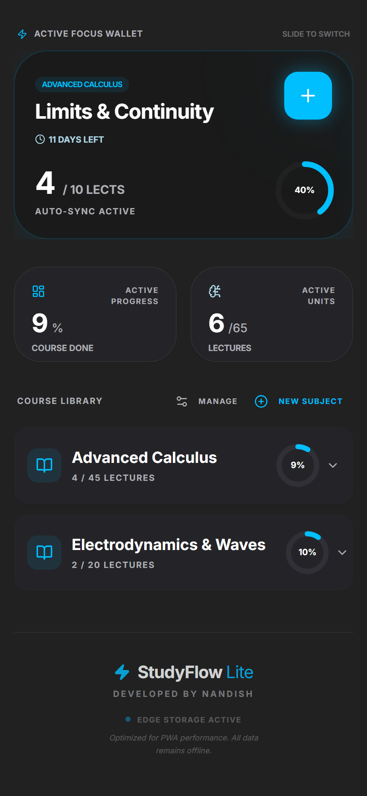

*Key Interface Elements:*
- **Active Focus Wallet Card**: Features electric cyan glow, single-tap `+` increment button, circular ring, course tag badge, and countdown timer.
- **Top Metric Cards**: Clean split-pane cards displaying active percentage and unit ratios strictly isolated from locked coursework.

---

### 2. Course Library & Collapsible Subject Accordion
The structured curriculum hierarchy displaying course modules, individual subject progress rings, and metric inclusion states:


*Key Interface Elements:*
- **Subject Header**: Displays subject title, completed vs. total unit counts, and customized 50px SVG progress ring.
- **Chapter Row**: High-contrast card with unlock state icon, progress bar, decrement/increment buttons, and date deadline picker.

---

### 3. Chapter Pacing Badges & Interactive Increment Controls
Detailed chapter row view highlighting the real-time **Daily Study Velocity Badge** ($1.2\text{ lects/day}$) and calendar countdown:

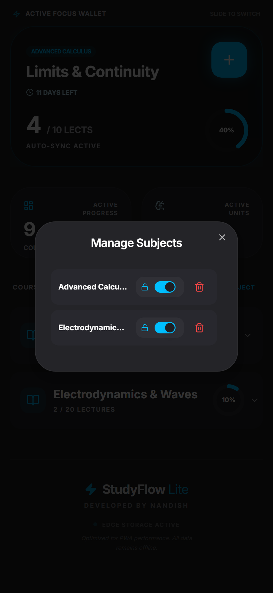

*Key Interface Elements:*
- **Velocity Badge**: Automatic evaluation of $\frac{T - C}{\Delta t}$ displayed directly in the chapter footer.
- **Locked Prerequisite Indicator**: Shows chapter 2 ("Derivatives & Chain Rule") locked and excluded from active progress pending chapter 1 completion.

---

### 4. New Chapter Creation Modal
Modal dialog enabling students to append new chapters with custom lecture quantities and initial active/locked states:

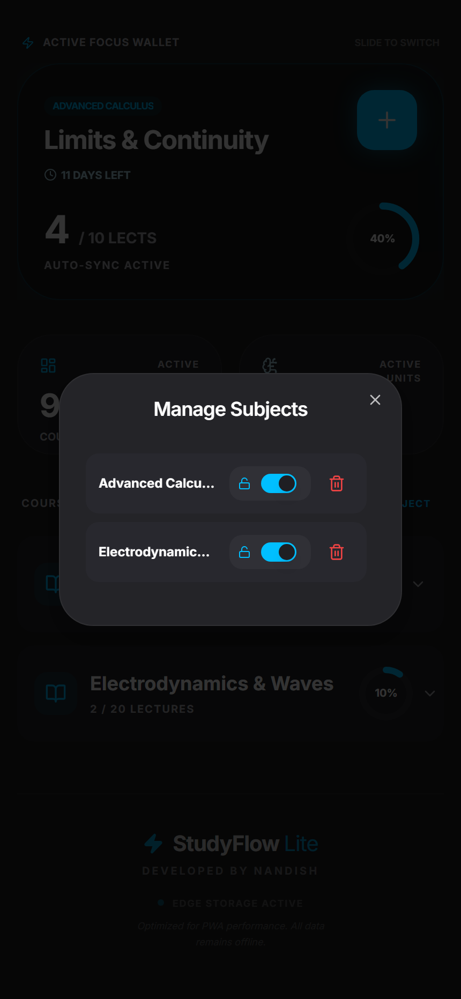

---

### 5. Chapter Configuration & Deletion Modal
Dedicated chapter management modal allowing inline renaming, lecture adjustment, manual unlock toggles, and secure chapter deletion:

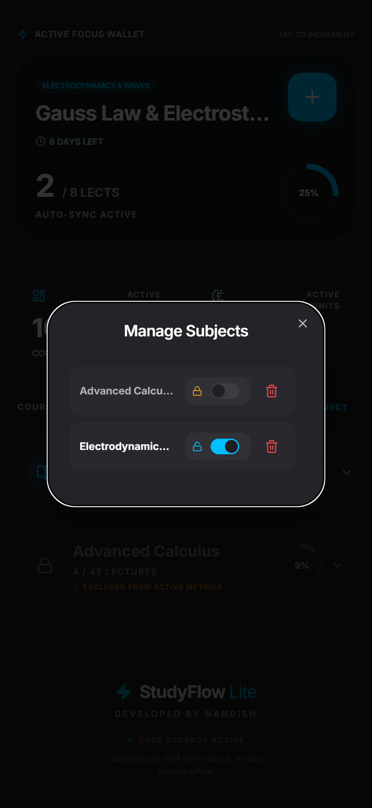

---

### 6. Subject Library Manager & Metric Exclusion Toggles
Comprehensive course manager modal allowing students to toggle subjects between **Active (Unlocked)** and **Archived (Excluded from active metrics)**:


---

### 7. Destructive Subject Deletion Confirmation Alert
Radix UI Alert Dialog preventing accidental syllabus deletion through explicit confirmation:


---

### 8. New Course / Subject Creation Modal
Modal interface for enrolling a new course into the curriculum with initial activation toggle:

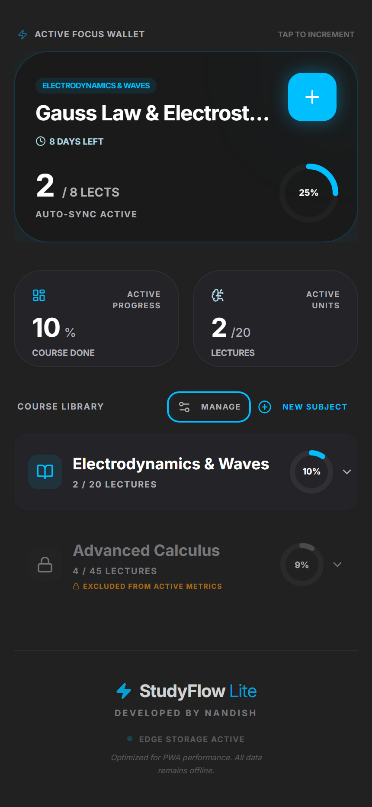

---

### 9. Sequential Prerequisite Auto-Unlock in Action
Demonstrating the deterministic auto-unlock trigger: completing Chapter 1 (10/10) automatically unlocks Chapter 2 ("Derivatives & Chain Rule"):

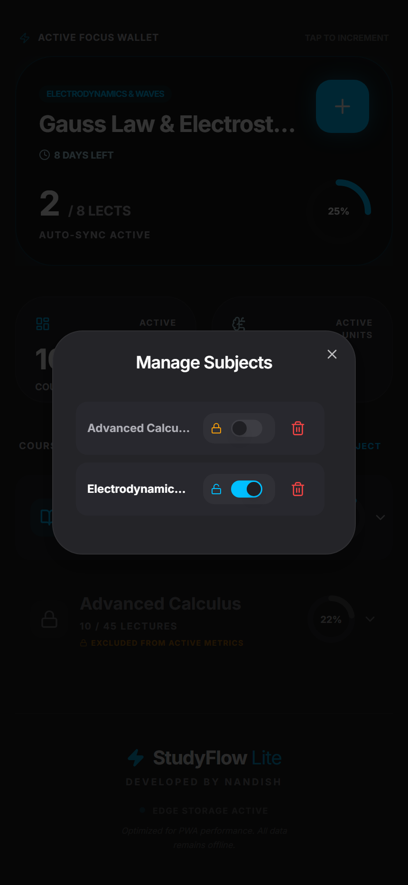

---

### 10. Completed Subject Auto-Lock & 100% Course Mastery
When all chapters within a subject are completed, the subject automatically locks and archives, and the dashboard celebrates **100% Course Done**:

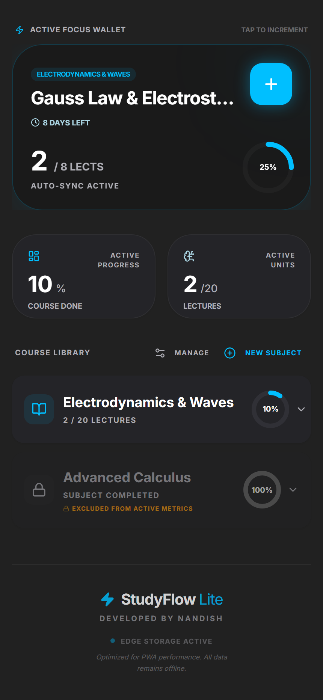

---

### 11. Cold Start & Zero-State Onboarding Screen
The clean, friendly empty state presented to a new student guiding them to create their first course:

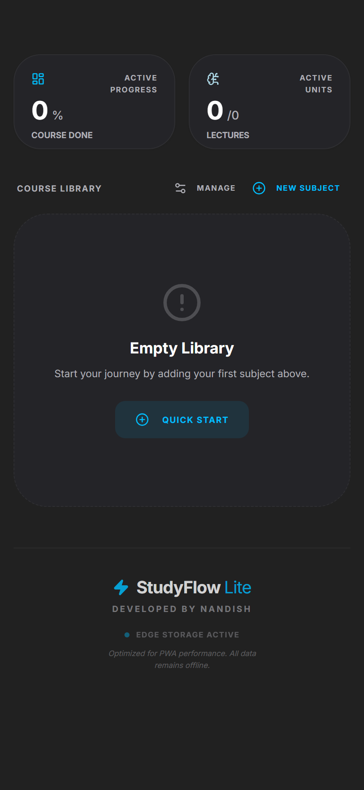

---

## 📂 Repository Structure

```
2026_004_StudyFlowProject/
│
├── src/
│   ├── app/
│   │   ├── globals.css              # Dark mode palette, CSS variables & no-scrollbar utilities
│   │   ├── layout.tsx               # Root layout, mobile viewport & PWA meta tags
│   │   ├── manifest.ts              # Next.js PWA Web Manifest (force-static)
│   │   └── page.tsx                 # Core StudyFlow Lite application & state engine
│   │
│   ├── components/
│   │   └── ui/                      # Radix UI + Tailwind accessible primitives
│   │       ├── accordion.tsx        # Collapsible course library accordion
│   │       ├── alert-dialog.tsx     # Destructive deletion confirmation dialog
│   │       ├── button.tsx           # Configurable variant button primitives
│   │       ├── card.tsx             # Glassmorphic card containers
│   │       ├── carousel.tsx         # Embla Carousel for Active Focus Wallet
│   │       ├── dialog.tsx           # Accessible modal popup primitive
│   │       ├── input.tsx            # Form text & number inputs
│   │       ├── label.tsx            # Form typography labels
│   │       ├── progress.tsx         # Horizontal linear progress bars
│   │       ├── switch.tsx           # iOS-style toggle switches
│   │       └── toaster.tsx          # Toast notification provider
│   │
│   ├── lib/
│   │   └── utils.ts                 # Classnames clsx & tailwind-merge helper
│   │
│   └── types/
│       └── studyflow.ts             # TypeScript definitions for Subject & Chapter
│
├── android/                         # Capacitor Android Native Project
│   ├── app/
│   │   ├── src/main/
│   │   │   ├── AndroidManifest.xml  # Native Android permissions & orientation
│   │   │   ├── assets/public/       # Next.js static production export bundle
│   │   │   ├── java/com/studyflow/  # MainActivity.java (Capacitor Bridge)
│   │   │   └── res/                 # App launcher icons, splash screens & styles
│   │   └── build.gradle             # Android build script & SDK targets
│   ├── build.gradle                 # Project-level Gradle build script
│   ├── capacitor.settings.gradle    # Capacitor plugin linking
│   └── local.properties.example     # Clean Android SDK template (No machine paths)
│
├── docs/
│   └── screenshots/                 # 11 High-Resolution mobile interface captures
│       ├── 01_dashboard_focus_wallet.png
│       ├── 02_subject_chapters_expanded.png
│       ├── 03_chapter_pacing_and_controls.png
│       ├── 04_add_new_chapter_modal.png
│       ├── 05_edit_chapter_modal.png
│       ├── 06_manage_subjects_modal.png
│       ├── 07_delete_subject_confirmation.png
│       ├── 08_add_new_subject_modal.png
│       ├── 09_sequential_auto_unlock_demonstration.png
│       ├── 10_completed_subject_auto_lock.png
│       └── 11_empty_library_onboarding.png
│
├── public/                          # Public static web assets
│   ├── favicon.ico                  # Browser tab icon
│   ├── icon-192.png                 # PWA 192x192 splash icon
│   ├── icon-512.png                 # PWA 512x512 splash icon
│   └── logo.png                     # StudyFlow high-res logo
│
├── release/                         # Production compiled binary outputs
│   └── StudyFlow-v1.0.0-debug.apk   # Standalone Android APK (4.7 MB)
│
├── apphosting.yaml                  # Firebase App Hosting configuration
├── capacitor.config.ts              # Capacitor native bridge configuration
├── components.json                  # shadcn/ui configuration
├── next.config.ts                   # Next.js static HTML export configuration
├── package.json                     # NPM dependencies & operational scripts
├── postcss.config.mjs               # PostCSS Tailwind plugins
├── tailwind.config.ts               # Custom design system tokens
├── tsconfig.json                    # TypeScript compiler options & path aliases
├── .gitignore                       # Git exclusion rules for clean repository
├── LICENSE                          # MIT Open Source License (M NANDISH, 2026)
└── README.md                        # Master comprehensive project documentation
```

---

## 🚀 Step-by-Step Installation & Run Guide

### Prerequisites
- **Node.js**: v18.0 or higher (v24.x recommended)
- **NPM**: v9.0 or higher
- **Android Studio / SDK** *(optional, only for building native Android APK from source)*
- **Git**

---

### Step 1: Clone Repository
```bash
git clone https://github.com/Nandish-508379/StudyFlow.git
cd StudyFlow
```

---

### Step 2: Install Node Dependencies
```bash
npm install
```

---

### Step 3: Run Development Server
To launch the real-time interactive development server with hot module reloading:
```bash
npm run dev
```
Open your browser and navigate to:
```text
http://localhost:3000
```

---

### Step 4: Build Static Production Export
StudyFlow Lite compiles to a deterministic, pure static bundle using Next.js static HTML export:
```bash
npm run build
```
This generates optimized HTML, CSS, and JS chunks in the `out/` directory ready for any CDN, static web server, or PWA deployment.

---

### Step 5: Capacitor Android Synchronization & APK Compilation
To sync the static web build into the native Android Capacitor project:
```bash
# 1. Synchronize static export with Android assets
npx cap sync android

# 2. Open project in Android Studio (optional)
npx cap open android

# 3. Or compile directly from command line using Gradle Wrapper
cd android
./gradlew assembleDebug
```
The compiled Android APK will be generated at:
```text
android/app/build/outputs/apk/debug/app-debug.apk
```

---

### Step 6: Running the Standalone Prebuilt APK
A pre-compiled native Android APK is conveniently provided in the repository under `release/`:
1. Transfer `release/StudyFlow-v1.0.0-debug.apk` to your Android device (Android 8.0+ supported).
2. Tap the APK file and select **Install** (allow unknown sources if prompted).
3. Launch **StudyFlow** directly from your app drawer with complete offline capability.

---

## 🔒 Confidentiality & Production Readiness Audit

Prior to publication on GitHub, this repository underwent an exhaustive security and confidentiality sanitization:
1. **Sanitization of Local Machine Paths**:
   - Removed machine-specific `local.properties` containing local developer directories (`C:\Users\nandi\...`).
   - Provided clean, universal `android/local.properties.example` template with cross-platform instructions.
2. **Purging of Internal Notes & Sample Documents**:
   - Removed temporary reference documents (`SAMPLE_README_DO_NOT_PUBLISH.md`, `imp info read me.txt`, `modified.txt`).
   - Removed scratch test profiles and test automation scripts (`scratch_edge_profile`, `capture_screens.js`).
3. **Comprehensive Git Inclusions**:
   - Configured `.gitignore` to prevent leakage of credentials, `.env` files, build caches (`.next/`, `.gradle/`, `.idea/`), and OS temporary metadata.
4. **Credential & Secret Scan**:
   - Zero hardcoded private API keys, cloud secrets, tokens, or personal credentials exist in the codebase.

---

## 👤 Author & Project Details

- **Author**: **M NANDISH** ([@Nandish-508379](https://github.com/Nandish-508379))  
- **Year of Project**: `2026`  
- **Project ID**: `004/2026`  
- **Project Name**: StudyFlow (StudyFlow Lite)  
- **Project Type**: Personal Study Cycle & Workload Pacing System  
- **Field**: Mobile Computing | PWA Edge Systems | Personal Productivity & Learning Systems  

---

## 📄 License

This project is licensed under the [MIT License](LICENSE) - see the LICENSE file for details.  
Copyright (c) 2026 **M NANDISH**. All rights reserved.
